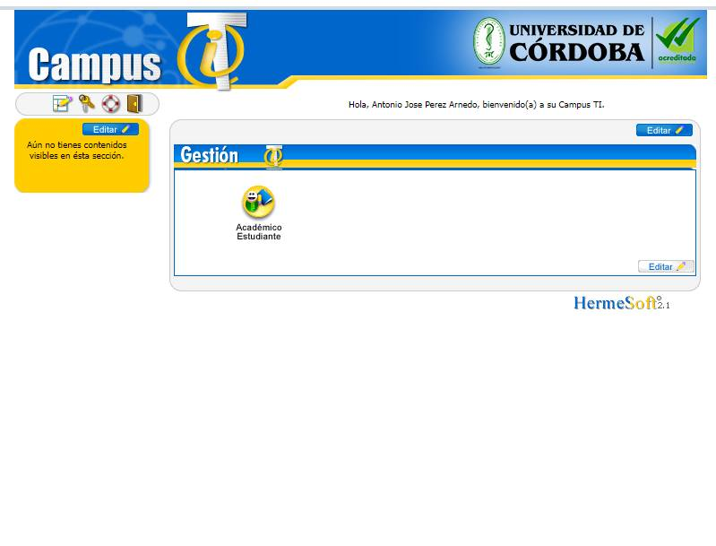
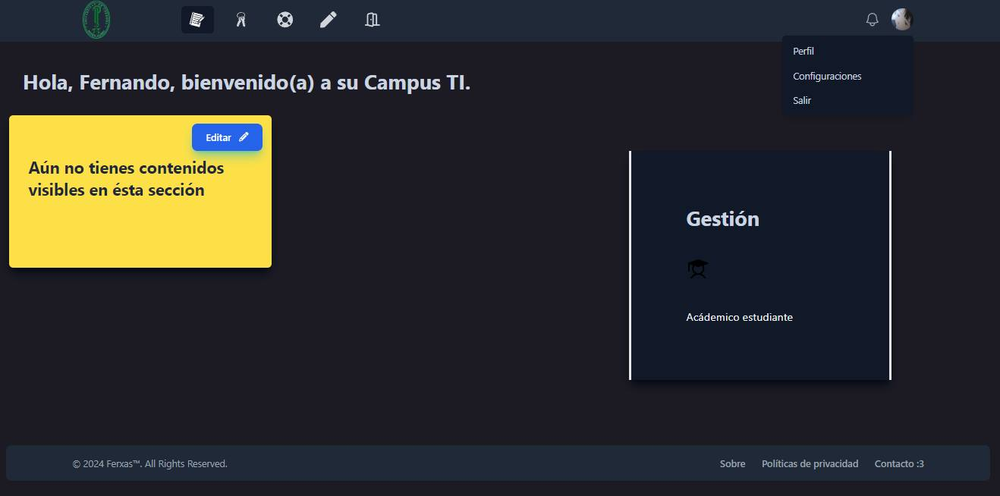

# Unicor front design using React + Vite

Template design for University of Cordoba 🧑‍🎓 

### Screenshot used 

[Unicor](./screenshots/unicor.jpg "unicor screenshot")

 
 

[Unicor front design using React + Vite](/screenshots/screenshot.jpg)

Plugins used:

- [@vitejs/plugin-react](https://github.com/vitejs/vite-plugin-react/blob/main/packages/plugin-react/README.md) uses [Babel](https://babeljs.io/) for Fast Refresh
- [@vitejs/plugin-react-swc](https://github.com/vitejs/vite-plugin-react-swc) uses [SWC](https://swc.rs/) for Fast Refresh

## Get and run the project

- [x] `git clone https://github.com/Ferxas/unicor-front-react-tailwind`
- [x]  `cd unicor-front-react-tailwind`
- [x] `npm install`
- [x] `npm run dev`
